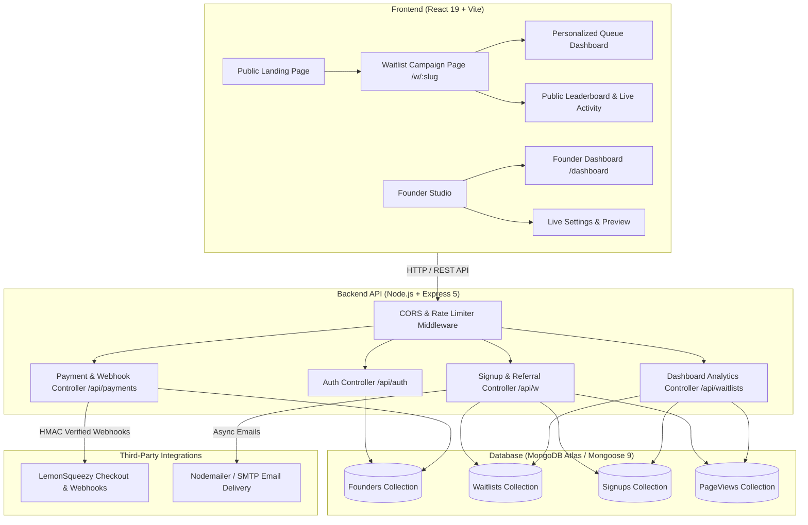

# 🚀 LaunchQueue

> **The viral waitlist and referral marketing engine for modern SaaS launches.**  
> Turn early launch interest into compounding word-of-mouth referral loops with gamified queue positions and milestone reward tiers.

[](https://github.com/codeWith-Ashwani/launchqueue-backend/actions/workflows/ci.yml)
[](https://github.com)
[](https://github.com)
[](LICENSE)

---

## 📖 Product Overview

**LaunchQueue** is a full-stack SaaS platform that allows founders to create, deploy, and analyze gamified pre-launch waitlists in under two minutes. 

Instead of static, low-converting email collection forms, LaunchQueue gives every subscriber a **live queue position** and a **unique referral link**. When subscribers invite friends, they climb the queue in real-time, unlocking tiered milestone rewards (such as early beta access, discount badges, or exclusive swag).

### 🎯 Key Highlights
- **Viral Referral Engine**: Dynamic algorithm boosts subscribers' queue position by +5 spots per successful invitation.
- **Milestone Rewards Ladder**: Configurable tiered rewards that incentivize users to share.
- **Conversion & Funnel Analytics**: Lightweight `PageView` system tracking unique visitors, signups, and conversion rate (%) with anti-spam deduplication.
- **Public Referrer Leaderboard**: Live Top 10 community leaderboard with automatic privacy masking for emails.
- **Live Activity Feed**: Real-time ticker showing recent subscriber activity with relative timestamps and polling updates.
- **Founder Live Preview**: Responsive 2-column settings studio with zero-latency preview of changes before saving.
- **Anti-Gaming Protections**: Blocks self-referrals, prevents duplicate credit, and filters disposable temporary emails.
- **Monetization Ready**: Integrated LemonSqueezy subscription checkout with signature-verified webhook handlers.
- **Modern Monochrome UI**: Built with a sleek black-and-white SaaS design system inspired by Vercel, Linear, and Stripe.

---

## 📸 Screenshots & UI Preview

| Public Waitlist & Live Queue | Founder Analytics Dashboard |
| :---: | :---: |
|  |  |
| *Personalized queue position, referral tracking & ASCII progress bar* | *Visitor metrics, conversion rate, 30-day signup chart & leaderboard* |

| Live Founder Settings & Preview | Public Community Leaderboard |
| :---: | :---: |
|  |  |
| *Side-by-side live preview that updates synchronously as you type* | *Anonymized Top 10 community advocates driving referral growth* |

---

## 🏗️ Architecture & System Design



---

## ⚡ The Viral Referral Engine

The core referral logic is calculated deterministically on the backend to ensure absolute data integrity.

### Mathematical Position Formula
$$\text{Current Position} = \max\left(1, \text{Base Position} - (\text{Referral Count} \times 5)\right)$$

### Referral Flow
```text
User A (Signed Up) ───[Shares Invite Link: ?ref=ABC123]───> User B (New Visitor)
                                                                    │
                                                            [Sees Public Signup]
                                                                    │
                                                            [Submits Email]
                                                                    │
                        ┌───────────────────────────────────────────┴───────────────────────────────────────────┐
                        ▼                                                                                       ▼
           User B (New Subscriber)                                                                  User A (Referrer)
   • Assigned new queue position (#200)                                                     • referralCount incremented (+1)
   • Issued unique referral code (XYZ789)                                                   • Position boosted (#150 → #145)
   • Linked to User A (referredBy: "ABC123")                                                • Rank-up notification email dispatched
```

### Security & Anti-Gaming Rules
1. **Self-Referral Prevention**: If User A signs up with their own referral code, the backend rejects referrer attribution.
2. **Duplicate Attribution Protection**: If an email has already joined, the API returns `alreadyJoined: true` and blocks duplicate referral credit.
3. **Disposable Email Filter**: Uses `disposable-email-domains` to reject temporary/burner emails.
4. **State Isolation**: Opening a referral link `?ref=CODE` never authenticates the visitor or leaks the referrer's private data.

---

## 🛠️ Tech Stack

### Frontend
- **Framework**: React 19 (Hooks, Context API)
- **Tooling & Bundler**: Vite 8
- **Routing**: React Router 7
- **HTTP Client**: Axios with global JWT request interceptors
- **Data Visualization**: Recharts (Signups over time chart)
- **Styling**: Custom Monochrome SaaS Design System (Pure grayscale CSS tokens, CSS Grid, Flexbox)

### Backend
- **Runtime & Framework**: Node.js, Express 5
- **Database & ODM**: MongoDB with Mongoose 9
- **Authentication**: JWT (JSON Web Tokens) with `httpOnly`-ready Bearer authorization & `bcryptjs`
- **Security & Protection**: `express-rate-limit`, strict CORS origin whitelisting, HMAC SHA-256 signature verification
- **Email Delivery**: Nodemailer (SMTP transactional emails with responsive HTML templates)
- **Payments**: LemonSqueezy API v1 with raw body signature verification

---

## 📡 API Reference

> 📚 **Interactive Swagger API Documentation**: Available locally at `http://localhost:5000/api/docs` or via the [OpenAPI 3.0 Specification](server/openapi.yaml).

### 🌐 Public Endpoints (`/api/w`)
| Method | Route | Description | Rate Limited |
| :--- | :--- | :--- | :---: |
| `GET` | `/api/w/:slug` | Retrieve public waitlist branding, features & milestones | No |
| `POST` | `/api/w/:slug/signup` | Join the waitlist with optional `ref` referral code | **Yes** (5 req / 15 min) |
| `GET` | `/api/w/:slug/position` | Check rank & rewards by `?ref=CODE` or `?email=EMAIL` | No |
| `GET` | `/api/w/:slug/leaderboard` | Get Top 10 referrers with anonymized emails | No |
| `GET` | `/api/w/:slug/activity` | Get recent real-time signups with masked PII | No |
| `POST` | `/api/w/:slug/visit` | Record unique pageview with 30-min deduplication window | No |

### 🔐 Founder Authentication (`/api/auth`)
| Method | Route | Description | Auth Required |
| :--- | :--- | :--- | :---: |
| `POST` | `/api/auth/register` | Create a new founder account | No |
| `POST` | `/api/auth/login` | Authenticate founder and return JWT token | No |
| `GET` | `/api/auth/me` | Fetch currently authenticated founder profile | **JWT** |

### 📊 Waitlist Management & Analytics (`/api/waitlists`)
| Method | Route | Description | Auth Required |
| :--- | :--- | :--- | :---: |
| `POST` | `/api/waitlists` | Create a new waitlist campaign | **JWT** |
| `GET` | `/api/waitlists` | List all waitlists owned by authenticated founder | **JWT** |
| `GET` | `/api/waitlists/:id` | Get single waitlist configuration | **JWT** |
| `PATCH` | `/api/waitlists/:id` | Update branding, headline, features, and milestones | **JWT** |
| `GET` | `/api/waitlists/:id/stats` | Get analytics: visitors, signups, conversion rate, chart | **JWT** |
| `GET` | `/api/waitlists/:id/export` | Export waitlist subscribers as CSV (Paid plan gated) | **JWT** |

### 💳 Payments & Billing (`/api/payments`)
| Method | Route | Description | Auth Required |
| :--- | :--- | :--- | :---: |
| `POST` | `/api/payments/checkout` | Generate LemonSqueezy hosted checkout session | **JWT** |
| `POST` | `/api/payments/webhook` | Process LemonSqueezy subscription events | **HMAC SHA-256** |

---

## 🗄️ Database Schemas

### `founders`
- `email`: String (Unique, Lowercase, Required)
- `passwordHash`: String (bcrypt hashed)
- `plan`: String (`free` | `starter` | `pro` | `agency`, Default: `free`)
- `createdAt`, `updatedAt`: Timestamps

### `waitlists`
- `founderId`: ObjectId (Ref: `Founder`, Required)
- `name`: String (Required)
- `slug`: String (Unique, Lowercase, Required)
- `description`, `heroHeadline`, `heroSubheadline`, `heroImageUrl`, `accentColor`, `ctaText`: Strings
- `features`: Array of `{ icon, title, description }`
- `milestones`: Array of `{ referrals, reward }`
- `paused`: Boolean (Default: `false`)

### `signups`
- `waitlistId`: ObjectId (Ref: `Waitlist`, Required)
- `email`: String (Required, Lowercase)
- `refCode`: String (Unique, 8-char nanoid/hex)
- `referredBy`: String (Null or referrer `refCode`)
- `basePosition`: Number (Initial chronological rank)
- `currentPosition`: Number (Dynamic rank computed with referral boosts)
- `referralCount`: Number (Total valid referred users)
- *Compound Index*: `{ waitlistId: 1, email: 1 }` (Unique)

### `pageviews`
- `waitlistId`: ObjectId (Ref: `Waitlist`, Required)
- `visitorId`: String (Unique visitor fingerprint)
- `createdAt`: Date (Indexed)
- *Compound Index*: `{ waitlistId: 1, visitorId: 1, createdAt: -1 }`

---

## 🚀 Local Development Setup

### Prerequisites
- **Node.js** >= 18.0.0
- **MongoDB** (Local instance or MongoDB Atlas URI)
- **npm** or **yarn** / **pnpm**

### 1. Clone the Repository
```bash
git clone https://github.com/codeWith-Ashwani/launchqueue.git
cd launchqueue
```

### 2. Backend Setup
```bash
# Navigate to backend directory
cd server

# Install dependencies
npm install

# Create local environment file
cp .env.example .env

# Start backend server in development mode
npm run dev
# -> Server running on http://localhost:5000
```

### 3. Frontend Setup
```bash
# Open a new terminal and navigate to client directory
cd ../client # or root of client repo

# Install dependencies
npm install

# Create local environment file
cp .env.example .env

# Start Vite development server
npm run dev
# -> Client running on http://localhost:5173
```

---

## ⚙️ Environment Variables

### Backend (`server/.env`)
| Variable | Description | Example |
| :--- | :--- | :--- |
| `PORT` | API server listening port | `5000` |
| `MONGO_URI` | MongoDB connection connection string | `mongodb://localhost:27017/launchqueue` |
| `JWT_SECRET` | Secret key for signing auth tokens | `super_secret_jwt_key_123` |
| `CLIENT_URL` | Frontend URL for CORS & share links | `http://localhost:5173` |
| `EMAIL_USER` | SMTP email username | `founder@example.com` |
| `EMAIL_PASS` | SMTP email password or app token | `xxxx xxxx xxxx xxxx` |
| `LEMONSQUEEZY_API_KEY` | LemonSqueezy API Bearer token | `eyJhbGciOi...` |
| `LEMONSQUEEZY_STORE_ID` | LemonSqueezy Store ID | `12345` |
| `LEMONSQUEEZY_WEBHOOK_SECRET`| LemonSqueezy Webhook HMAC signing secret | `whsec_...` |

### Frontend (`client/.env`)
| Variable | Description | Example |
| :--- | :--- | :--- |
| `VITE_API_URL` | Base URL of the LaunchQueue Backend API | `http://localhost:5000/api` |

---

## 🧪 Testing & Verification

The codebase includes automated test suites covering all core workflows:
```bash
# Run referral attribution and anti-gaming test suite
node server/test_referral.js

# Test conversion analytics and unique visitor aggregation
node server/test_analytics.js

# Build client for production validation
cd client && npm run build
```

---

## 📁 Project Structure

```text
launchqueue/
├── client/                     # React 19 Frontend Application
│   ├── src/
│   │   ├── api/                # Axios instance & JWT interceptors
│   │   ├── components/         # Reusable UI & Widget components
│   │   │   ├── LiveActivityFeed.jsx      # Real-time activity ticker
│   │   │   ├── PersonalizedWaitlistCard.jsx # Subscriber dashboard card
│   │   │   ├── ReferrerLeaderboard.jsx  # Top 10 leaderboard
│   │   │   ├── ShareModal.jsx           # Social sharing dialog
│   │   │   ├── SignupForm.jsx           # Waitlist signup input
│   │   │   ├── SignupsChart.jsx         # 30-day analytics chart
│   │   │   └── StatCard.jsx             # Metric cards
│   │   ├── context/            # AuthContext (JWT & session state)
│   │   ├── hooks/              # Custom hooks (useAuth, useWaitlist)
│   │   ├── pages/              # Routed views
│   │   │   ├── Dashboard.jsx            # Founder campaign list
│   │   │   ├── Home.jsx                 # Public marketing landing page
│   │   │   ├── Login.jsx / Register.jsx # Authentication
│   │   │   ├── Pricing.jsx              # Tier selection
│   │   │   ├── WaitlistDetail.jsx       # Analytics & subscriber exports
│   │   │   ├── WaitlistPage.jsx         # Public campaign page (/w/:slug)
│   │   │   └── WaitlistSettings.jsx     # Live 2-column preview & settings
│   │   ├── index.css           # Grayscale SaaS Design System
│   │   └── main.jsx            # React root entry
│   ├── .env.example
│   ├── package.json
│   └── vite.config.js
│
└── server/                     # Node.js Express API Backend
    ├── controllers/            # Request handlers
    │   ├── authController.js        # Founder login, register & /me
    │   ├── dashboardController.js   # Analytics, metrics & CSV export
    │   ├── paymentController.js     # LemonSqueezy checkouts & webhooks
    │   ├── signupController.js      # Public join, referral & leaderboard
    │   └── waitlistController.js    # Waitlist CRUD
    ├── middleware/             # Express middlewares
    │   ├── authMiddleware.js        # JWT verification
    │   └── rateLimiter.js           # IP rate limiting
    ├── models/                 # Mongoose Schemas
    │   ├── Founder.js
    │   ├── PageView.js              # Lightweight visit tracking
    │   ├── Signup.js                # Queue position & referral tree
    │   └── Waitlist.js              # Campaign settings & reward tiers
    ├── routes/                 # Express route definitions
    ├── templates/              # Transactional email HTML templates
    ├── utils/                  # Position math, refCode generation, disposable email check
    ├── .env.example
    ├── index.js                # Server entry & MongoDB connection
    └── package.json
```

---

## 🚢 Deployment Guide

### Deploying the Backend (Render / Railway / Fly.io / VPS)
1. Push the code to GitHub.
2. Link the repository to your host (e.g. **Render** or **Railway**).
3. Set the root directory to `server` (or run `npm start` in `server`).
4. Configure the environment variables in your hosting dashboard matching `.env.example`.

### Deploying the Frontend (Vercel / Netlify / Cloudflare Pages)
1. Link the repository to **Vercel** or **Netlify**.
2. Set root directory to `client`.
3. Set Build Command to `npm run build` and Output Directory to `dist`.
4. Add environment variable: `VITE_API_URL=https://your-backend-domain.com/api`.

---

## 🔮 Future Roadmap

- [ ] **Custom CNAME Domains**: Allow founders to point `waitlist.theircompany.com` directly to their LaunchQueue campaign.
- [ ] **Webhook Integrations**: Outbound webhooks to Zapier, Make, and Slack on new signups.
- [ ] **One-Line Embed Widget**: Dropdown script tag (`<script src=".../embed.js">`) for embedding the waitlist directly into existing Webflow or Next.js sites.

---

## 📄 License

This project is licensed under the **MIT License** - see the [LICENSE](LICENSE) file for details.
