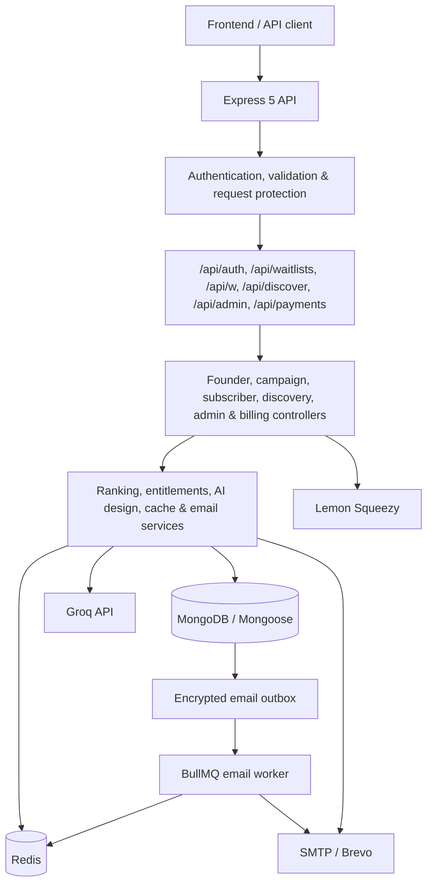

# LaunchQueue — Backend API

[](https://github.com/codeWith-Ashwani/launchqueue-backend/actions/workflows/ci.yml)
[](https://nodejs.org)
[](https://expressjs.com)
[](https://www.mongodb.com)

LaunchQueue helps founders create branded prelaunch pages, grow referral waitlists, and manage their early communities. This repository contains the API for campaign design, subscriber verification, referral ranking, analytics, billing, and platform administration.

[Live application](https://launchqueue-omega.vercel.app/) · [Frontend repository](https://github.com/codeWith-Ashwani/launchqueue) · [API documentation](https://launchqueue-backend.onrender.com/api/docs)

## Contents

- [Features](#features)
- [Tech stack](#tech-stack)
- [Backend architecture](#backend-architecture)
- [Core data models](#core-data-models)
- [Referral workflow](#referral-workflow)
- [API reference](#api-reference)
- [Local development](#local-development)
- [Environment configuration](#environment-configuration)
- [Admin access](#admin-access)
- [Subscription plans](#subscription-plans)
- [Testing and CI](#testing-and-ci)
- [Deployment](#deployment)
- [Author](#author)

## Features

- **Campaign management:** Founder-owned campaigns with editable branding, layouts, sections, images, signup copy, referral milestones, and pause/resume controls.
- **Groq page designer:** Converts product details and founder preferences into a structured design draft. Zod validates generated content before it can be saved, and founders can preview and edit the draft.
- **Product discovery:** Public weekly and all-time product rankings based on confirmed memberships. Founders explicitly opt campaigns into discovery; administrators can moderate listings.
- **Founder accounts:** Email/password and Google sign-in, editable profiles, campaign usage, subscription status, password resets, and session revocation.
- **Verified referral waitlists:** Email verification, campaign-scoped private status links, transactional referral credit, deterministic ranks, and duplicate-email protection.
- **Founder analytics:** Paginated subscriber lists, daily signup charts, visitor tracking, conversion summaries, queue controls, invitations, and streamed CSV exports for paid plans.
- **Platform administration:** Searchable founder, campaign, and subscriber records, platform totals, and audited discovery moderation. Access requires approval stored in MongoDB.
- **Redis infrastructure:** Shared rate-limit counters, short-lived public leaderboard caching, and BullMQ email jobs.
- **Email delivery:** Encrypted MongoDB outbox with inline or queued delivery through Nodemailer SMTP or Brevo HTTPS.
- **Subscription billing:** Lemon Squeezy checkout, signed webhooks, subscription lifecycle handling, billing portals, and server-enforced plan allowances.

## Tech stack

| Area | Technology |
| --- | --- |
| Runtime and API | Node.js 22, Express 5 |
| Database | MongoDB replica set, Mongoose 9 |
| Validation | Zod 4 |
| Authentication | JWT, HttpOnly cookies, bcrypt, Google Identity Services |
| Security | Helmet, CORS, origin checks, express-rate-limit |
| AI design | Groq structured outputs |
| Cache and jobs | Redis, ioredis, BullMQ |
| Email | Nodemailer, Brevo, encrypted outbox |
| Billing | Lemon Squeezy |
| API documentation | OpenAPI 3, Swagger UI |
| Testing | Jest, Supertest, mongodb-memory-server, Redis integration tests |

## Backend architecture

Routes delegate to controllers, with services handling ranking, entitlements, AI generation, caching, and email delivery. Middleware handles authentication, validation, origin checks, and rate limits.


```mermaid
flowchart TD
    CLIENT["Frontend / API client"] --> API["Express 5 API"]
    API --> AUTH["Authentication, validation & request protection"]
    AUTH --> ROUTES["/api/auth, /api/waitlists, /api/w, /api/discover, /api/admin, /api/payments"]
    ROUTES --> CONTROLLERS["Founder, campaign, subscriber, discovery, admin & billing controllers"]
    CONTROLLERS --> SERVICES["Ranking, entitlements, AI design, cache & email services"]
    SERVICES --> MONGO[("MongoDB / Mongoose")]
    SERVICES --> REDIS[("Redis")]
    SERVICES --> GROQ["Groq API"]
    CONTROLLERS --> BILLING["Lemon Squeezy"]
    MONGO --> OUTBOX["Encrypted email outbox"]
    OUTBOX --> WORKER["BullMQ email worker"]
    WORKER --> REDIS
    WORKER --> EMAIL["SMTP / Brevo"]
    SERVICES --> EMAIL
```

The API and worker share MongoDB and Redis. Email intentions are committed alongside business changes; delivery receipts update invitation status. Inline delivery uses the same outbox records.

## Core data models

| Model | Responsibility |
| --- | --- |
| `Founder` | Account identity, credentials, subscription state, session version, and `adminApproved` flag |
| `Waitlist` | Campaign ownership, public slug, branding, page design, discovery visibility, and queue versions |
| `Signup` | Subscriber identity, referral attribution, ranking inputs, verification, and invitation state |
| `PageView` | Deduplicated campaign visits for analytics |
| `EmailOutbox` | Encrypted notification payloads, retries, and delivery receipts |
| `BillingEvent` | Webhook deduplication and subscription event processing |
| `AIGenerationUsage` | Daily AI generation allowances |
| `AdminAudit` | Administrator discovery moderation history |

Unique indexes enforce one email per campaign and unique public slugs and referral codes. Campaign indexes support ownership queries, analytics, and discovery.

## Referral workflow

1. A visitor joins a campaign, optionally through a referral link.
2. The API validates the request and atomically allocates a signup sequence, creates a pending subscriber, and records a verification email.
3. Mailbox verification activates the subscriber and awards referral credit exactly once.
4. The ranking service orders eligible subscribers by `basePosition - referralCount * 5 + priorityOffset`, with sequence and document ID resolving ties, then assigns contiguous positions.
5. Campaign-scoped tokens provide private status access; recovery links are delivered by email.
6. Founders review analytics, adjust queue positions, and send access invitations. Delivery receipts move invitations from queued to sent or failed.

Public campaign leaderboards and activity feeds mask subscriber identities. Pending joins do not receive referral credit or participate in the queue until verified.

## API reference

Interactive request and response documentation is available at [`/api/docs`](https://launchqueue-backend.onrender.com/api/docs).

Endpoint names below are relative to their base path.

| Route group | Base path | Endpoints | Access |
| --- | --- | --- | --- |
| Authentication | `/api/auth` | `register`, `login`, `google`, `logout`, `me`, `config` | Session required for `me` |
| Founder profile | `/api/auth` | `overview`, `profile`, `password` | Founder session |
| Password recovery | `/api/auth` | `forgot-password`, `reset-password` | Public, rate limited |
| Campaign management | `/api/waitlists` | Root and `:id` | Campaign owner |
| AI page design | `/api/waitlists` | `POST design` | Founder session and generation allowance |
| Analytics and export | `/api/waitlists/:id` | `stats`, `funnel`, `export` | Campaign owner; paid plan for CSV |
| Subscriber controls | `/api/waitlists/:id/signups` | `:signupId/position`, `batch-invite` | Campaign owner |
| Public campaign | `/api/w/:slug` | Root, `signup`, `verify`, `status-link`, `leaderboard`, `activity`, `visit` | Public; verification/status proofs where applicable |
| Private position | `/api/w/:slug` | `GET position` | `X-Subscriber-Token` |
| Product discovery | `/api/discover` | `GET leaderboard?period=week` or `period=all` | Public, rate limited |
| Administration | `/api/admin` | `overview`, `founders`, `campaigns`, `subscribers` | Database-approved admin |
| Discovery moderation | `/api/admin` | `PATCH campaigns/:id/discovery` | Database-approved admin, audited |
| Billing | `/api/payments` | `checkout`, `portal` | Founder session |
| Billing webhook | `/api/payments` | `POST webhook` | Provider HMAC signature |
| Health | `/` | `health`, `ready` | Public |

Founder sessions use HttpOnly cookies with Bearer-token support for API clients. Cookie-based mutations require `X-LaunchQueue-Request: 1` and a trusted origin. Password changes, resets, and authenticated logout revoke earlier sessions. Request logs include request IDs and durations while excluding private payloads and tokens.

## Local development

Use Node.js 22 (at least 22.13) and a MongoDB replica set that supports transactions.

```sh
git clone https://github.com/codeWith-Ashwani/launchqueue-backend.git
cd launchqueue-backend/server
npm ci
cp .env.example .env
npm run dev
```

On PowerShell, use `Copy-Item .env.example .env` instead of `cp`. Configure the values described below before starting. The API runs at `http://localhost:5000`, with Swagger UI at `http://localhost:5000/api/docs`.

### Local demo

Run from the backend repository root:

```sh
cd server
npm run demo
```

The demo runs a loopback API on port 5051 with an ephemeral MongoDB replica set, 120 synthetic subscribers, and captured email. Point the frontend to `http://localhost:5051/api`.

| Demo account | Email | Password |
| --- | --- | --- |
| Founder | `demo@example.com` | `DemoPassword123!` |
| Approved admin | `admin@example.com` | `DemoAdmin123!` |

Open `/w/interview-demo` in the frontend and inspect captured messages at `http://localhost:5051/__demo/inbox`. These accounts belong only to the isolated demo; the script never connects to the production database or sends real email.

## Environment configuration

The complete configuration template is [`server/.env.example`](server/.env.example). Store server credentials in `server/.env` locally and in the hosting environment in production.

| Variables | Purpose |
| --- | --- |
| `PORT`, `NODE_ENV` | API port and runtime environment |
| `MONGO_URI` | MongoDB replica set connection |
| `JWT_SECRET` | Strong session signing secret |
| `CLIENT_URL` | Frontend origin for CORS and email links |
| `GOOGLE_CLIENT_ID` | Google OAuth web client ID; exposed as public configuration through `/api/auth/config` |
| `GROQ_API_KEY`, `GROQ_MODEL` | Backend-only Groq credentials and structured-output model; default model: `openai/gpt-oss-120b` |
| `AI_DAILY_LIMIT` | Application-wide daily AI allowance; default 20, with five generations per founder per day |
| `REDIS_URL`, `TRUST_PROXY_HOPS` | Redis connection and explicit trusted proxy hop count |
| `EMAIL_PROVIDER` | `smtp` or `brevo` |
| `EMAIL_USER`, `EMAIL_PASS`, `EMAIL_HOST`, `EMAIL_PORT`, `EMAIL_SECURE` | SMTP delivery settings |
| `BREVO_API_KEY`, `EMAIL_FROM`, `EMAIL_FROM_NAME` | Brevo HTTPS credentials and verified sender |
| `EMAIL_DELIVERY_MODE`, `EMAIL_ENCRYPTION_KEY` | `inline` or `queue` delivery and stable outbox encryption key |
| `LEMONSQUEEZY_API_KEY`, `LEMONSQUEEZY_STORE_ID`, `LEMONSQUEEZY_WEBHOOK_SECRET` | Checkout and webhook configuration |
| `LEMONSQUEEZY_STARTER_VARIANT_ID`, `LEMONSQUEEZY_PRO_VARIANT_ID`, `LEMONSQUEEZY_AGENCY_VARIANT_ID` | Plan variants |
| `LEMONSQUEEZY_TEST_MODE` | Billing integration test mode |

## Admin access

Admin approval is stored on the founder's database record and checked on every admin request. New accounts default to `adminApproved: false`; signup and profile forms cannot assign this field.

A trusted database operator can approve an existing account by matching its Account ID from `/profile`:

```javascript
db.founders.updateOne(
  { _id: ObjectId("YOUR_FOUNDER_ACCOUNT_ID") },
  { $set: { adminApproved: true } }
);
```

Then sign in through **Admin login** in the landing page footer or `/admin/login`. Setting the flag to `false` revokes access on the next admin API request, including existing sessions.

## Subscription plans

| Plan | Campaigns | Signups per campaign | CSV export |
| --- | ---: | ---: | --- |
| Free | 1 | 500 | No |
| Starter | 3 | 5,000 | Yes |
| Pro | 10 | 25,000 | Yes |
| Agency | Unlimited | Unlimited | Yes |

Campaign creation and signup allowances are checked inside MongoDB transactions. Billing events are signature-verified, deduplicated, and ordered by provider timestamps. Subscription state determines effective access, including cancellation periods.

## Testing and CI

Run from `server/`:

```sh
npm run lint
npm test
npm audit --omit=dev --audit-level=high
```

The backend suite contains **196 tests across 38 suites**, including Redis integrations. Tests cover authentication, database admin approval and revocation, ownership, concurrent verification and referral credit, queue ordering, private status recovery, AI draft validation, discovery moderation, analytics, exports, billing, email delivery, trace privacy, collector delivery, and diagnostics authorization.

MongoDB tests use isolated in-memory replica sets. Set `TEST_REDIS_URL` to a test Redis instance to include BullMQ and shared rate-limit integration tests; those suites are skipped locally when it is absent. GitHub Actions provisions Redis and runs the complete suite, lint, and production dependency audit on `main`, `feature/**`, and pull requests to `main`.

The [frontend repository](https://github.com/codeWith-Ashwani/launchqueue) adds unit/component and Playwright coverage against the real isolated API. `npm run benchmark` measures paginated analytics with synthetic data.

## Performance and observability

Install [k6 2.3.0](https://github.com/grafana/k6/releases/tag/v2.3.0), then run from `server/`:

```sh
npm run performance:smoke
npm run performance:matrix
```

The runner owns a temporary MongoDB replica set, creates synthetic subscribers and a temporary founder session, and accepts only its loopback API. The smoke test uses 1,000 subscribers, five virtual users, and 20 requests. The full matrix uses 1,000, 10,000, and 50,000 subscribers at one, five, and ten concurrent virtual users, with 50 requests per case. Every response must return 50 contiguous ranks and the correct total. Gates require p95 below `PERFORMANCE_P95_MS` (default 2,000 ms), zero request errors, and all checks passing. GitHub Actions verifies the pinned k6 binary's checksum, runs the smoke gate, and saves measurements as an artifact.

Reports include p50/p95, throughput, response size, and correctness. Generated reports remain in ignored `docs/performance/`. These warmed, closed-workload measurements describe this fixture; use the same environment and workload when comparing changes.

A local Node 22 baseline measured p95 at **61 ms / 219 ms / 2,140 ms** for 1,000 / 10,000 / 50,000 subscribers with ten virtual users and 50 requests per case. All response checks passed with zero request errors. The 50,000-subscriber case exceeded the two-second gate, identifying a concrete target for ranking-query optimization rather than claiming production capacity.

Database-approved admins can read `GET /api/admin/diagnostics` for route latency, operation latency, process memory, event-loop delay, anonymous Web Vitals, email state counts, and the oldest unsent email age. Counters belong to one process and reset on restart; percentiles use the most recent 128 samples per label. Labels use route templates and fixed operation names, excluding resource IDs, emails, tokens, request bodies, and raw errors.

OpenTelemetry exports sampled request and child-operation traces when `OTEL_ENABLED=true`, `OTEL_EXPORTER_OTLP_TRACES_ENDPOINT` points to an OTLP/HTTP collector's trace endpoint, and `OTEL_TRACE_SAMPLE_RATE` is set between zero and one. Export is disabled by default; diagnostics work independently. Worker deployments use the same telemetry settings with a distinct `OTEL_SERVICE_NAME`. Request logs include a trace ID when tracing is active; `Server-Timing` exposes application response duration to browser tools.

## Deployment

The frontend is hosted on Vercel and the API on Render. For the API, use `server` as the root directory, `npm ci` as the build command, and `npm start` as the start command. Configure a MongoDB replica set, the frontend `CLIENT_URL`, and the required server environment variables.

Use `EMAIL_PROVIDER=brevo` for HTTPS email delivery or configure SMTP. Inline mode runs delivery in the API process. For queued delivery, run a persistent worker with `npm run worker`, share the MongoDB, Redis, encryption, and email configuration with the API, use Redis's `noeviction` policy, and set `EMAIL_DELIVERY_MODE=queue` after the worker is connected.

`/health` reports process liveness; `/ready` reports database readiness and Redis availability. Set the Lemon Squeezy webhook to `/api/payments/webhook` and configure subscription events. Backend feature branches run CI; deployments use the configured production branch.

## Author

Built and maintained by [codeWith-Ashwani](https://github.com/codeWith-Ashwani).
